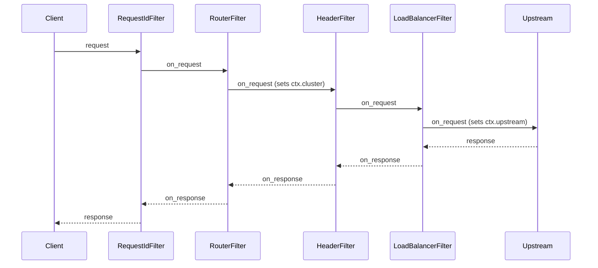
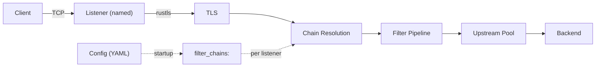
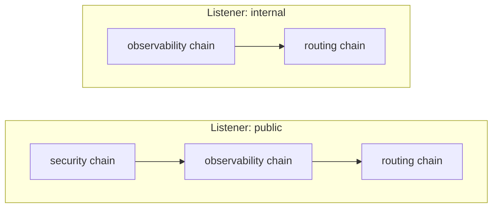
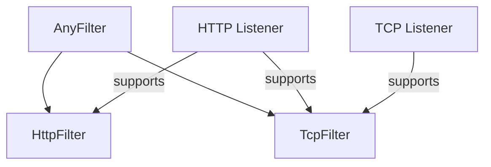
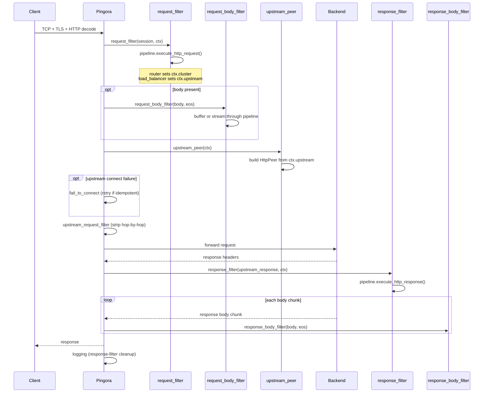
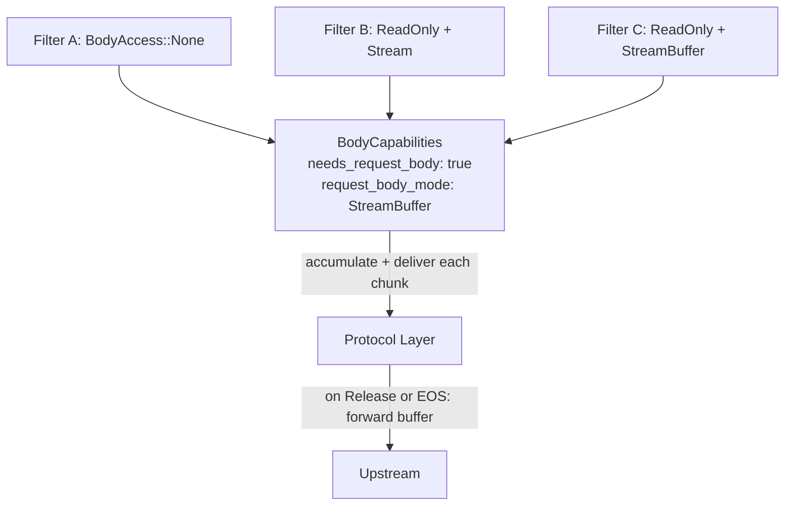
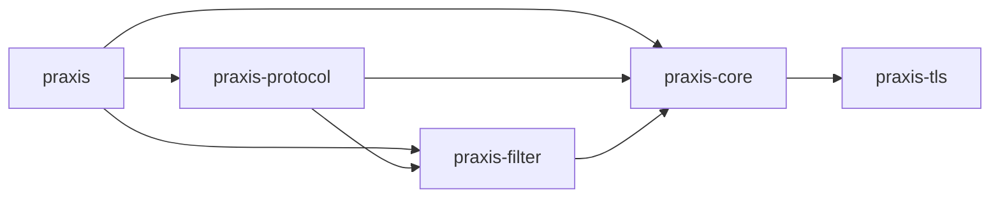
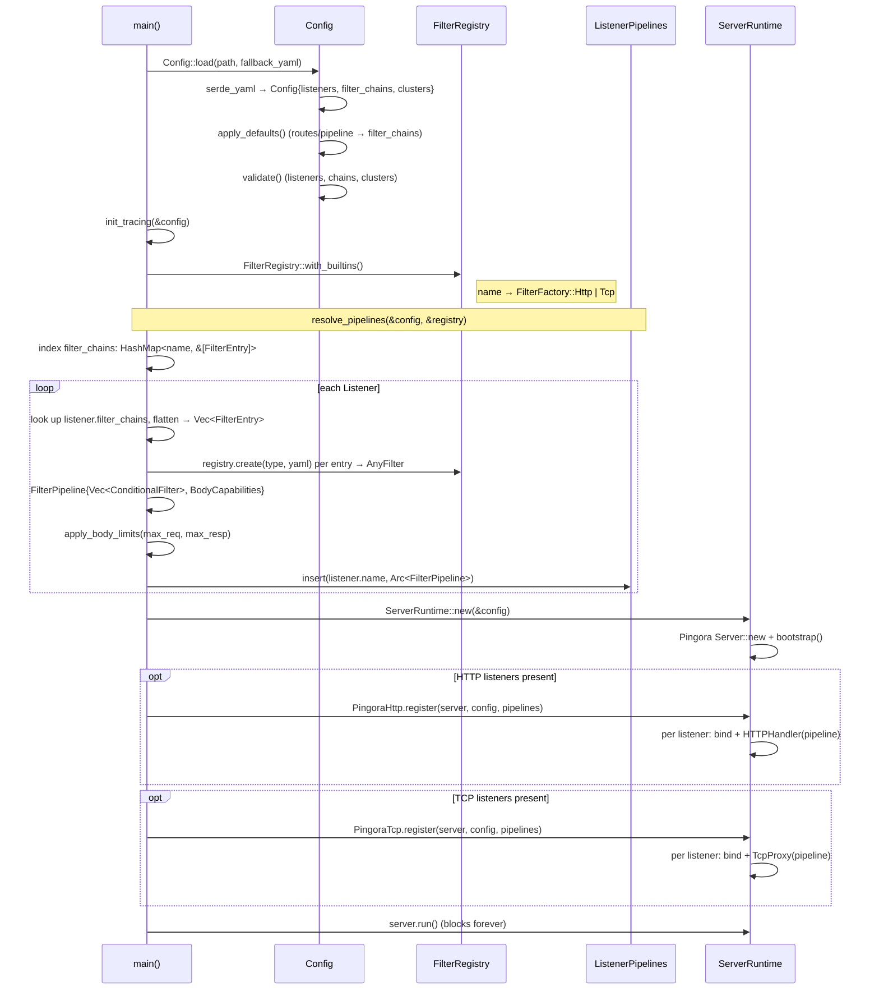

# Architecture

## Design Principles

**General-Purpose with Notable Specializations.** Praxis is
designed to be general purpose, but there are specialized
use-cases that are covered as well. These use cases are built
as 1st party [extensions] and include: Egress, AI Inference,
AI Agents, etc.

**Adaptive.** Praxis is designed to be composable, extensible,
and programmable by non-experts. Praxis is a **framework**
for building proxies, in addition to providing core builds.
Core behaviors (routing, load balancing, etc) use the same
filter traits as extensions. No architectural privilege, no
getting locked in only second factor extension mechanisms.

**Use upstream protocols; contribute upstream.** Protocol
adapters delegate transport to upstream libraries. If a
capability is missing, contribute it upstream. Adapter crates
must stay thin; extensive protocol logic belongs in its own
crate, upstream whenever feasible.

**Safety and performance.** Rustls over OpenSSL (by default).
Minimize hot-path allocations; `Bytes` for zero-copy buffer
sharing. `#![deny(unsafe_code)]` until all else fails.

[extensions]:./extensions.md

## Primary Use-Cases

- **Ingress**: Reverse proxy, API gateway, edge proxy
- **Egress**: Outbound proxy, service-to-service
- **East/West**: Sidecar or converged proxy for service mesh
- **AI Inference**: Proxy for AI inference workloads
- **AI Agents**: Proxy for AI agents
- **Security Gateway**: Guardrails, Network Policy

## System Architecture

### Protocol Adapters

Adapters translate upstream library callbacks into pipeline
invocations. When feasible Praxis owns no protocol logic,
instead handing it off to well-maintained and battle-tested
upstream solutions.

```text
HTTP  --> praxis-protocol/http  --> Pingora
TCP   --> praxis-protocol/tcp   --> Pingora
QUIC  --> praxis-protocol/http3 --> Quiche  (planned, not yet implemented)
```

These adapters are modular, it's intended to enable adding new protocols by
writing new adapters, and even having multiple implementations of a single
protocol that can be swapped via build features or runtime configuration.

### Filter-First Design

Every behavior is a filter. Built-in filters use the same
traits as user-provided filters.



Request filters run in declared order, response filters in
reverse. Any filter can short-circuit, and multiple payload
processing options are available to do filtering, routing,
caching and load-balancing based on request or response bodies.

See [filters.md] for more extensive documentation on the filter
system, and [extensions.md] for how to write your own.

[filters.md]:./filters.md
[extensions.md]:./extensions.md

### Listeners



Each listener has a `name` and a list of `filter_chains`.
At startup, the referenced chains are resolved and
concatenated into a single pipeline per listener. Different
listeners can compose different subsets of chains.

### Filters

Filter chains are named, reusable groups of filters defined
at the top level of the config. A listener references one or
more chains by name; the filters are concatenated in order
to form that listener's pipeline.



This enables reuse without duplication. A "security" chain
can be shared across public listeners while internal
listeners skip it entirely.

#### Protocol-Aware Filters

Filters are protocol-aware. HTTP filters implement the
`HttpFilter` trait (`on_request`, `on_response`, body hooks).
TCP filters implement the `TcpFilter` trait (`on_connect`,
`on_disconnect`). The `AnyFilter` enum wraps both variants
for storage in a unified pipeline.

Protocol compatibility is enforced via `ProtocolKind::stack()`
and `supports()`. An HTTP listener supports both HTTP and TCP
filters. A TCP listener supports only TCP filters.



### What Stays Outside Filters

- TCP/TLS, HTTP framing, connection pooling: adapters
- Config loading and validation: `praxis-core`
- Pipeline executor and `HttpFilterContext`: `praxis-filter`

## HTTP Connection Lifecycle



1. TCP accept, TLS handshake, HTTP decode (Pingora)
2. `request_filter`: pipeline runs filters in order; router
   sets `ctx.cluster`, load balancer sets `ctx.upstream`
3. `request_body_filter`: buffer or stream body chunks
   through filters (if any filter declares body access)
4. `upstream_peer`: converts `ctx.upstream` to `HttpPeer`
5. Connect to upstream; `fail_to_connect` retries
   idempotent requests on failure
6. `upstream_request_filter`: strips hop-by-hop headers
7. Request forwarded, response headers received
8. `response_filter`: pipeline runs filters in reverse
9. `response_body_filter`: stream response body through
   filters (synchronous; Pingora constraint)
10. `logging`: re-runs response filters if response
    phase was skipped (upstream error, filter rejection)
11. Connection returned to pool

## TCP Connection Lifecycle

1. TCP accept, optional TLS handshake
2. `on_connect` : TCP filters run in order
3. Bidirectional byte forwarding to upstream
4. `on_disconnect` : TCP filters run on close

## Payload Processing

Filters declare body access needs at construction time via
`request_body_access()`, `response_body_access()`, and the
corresponding `*_body_mode()` methods. The pipeline
pre-computes aggregate `BodyCapabilities` at build time so
the protocol layer knows whether to buffer or stream.



Three delivery modes:

- **Stream**: chunks flow through filters as they arrive.
  Low latency, low memory.
- **Buffer**: the protocol layer accumulates chunks into a
  `BodyBuffer`, then delivers the full body in a single
  call. Required when any filter needs the complete body.
- **StreamBuffer**: chunks are delivered to filters
  incrementally (like Stream) but accumulated in a buffer
  and not forwarded to upstream until a filter returns
  `FilterAction::Release` or end-of-stream. After release,
  remaining chunks flow through in stream mode. No size
  limit by default; an optional `max_bytes` returns 413
  when exceeded. Enables streaming inspection with deferred
  forwarding for AI inference, Agentic networks, and
  Security systems use cases including content scanning,
  payload inspection, and body-based routing.

When StreamBuffer mode is active, the protocol layer
pre-reads the body during the request phase (before
upstream selection) so that body filters can influence
routing decisions. The pre-read body is stored and
forwarded to the upstream after the connection is
established.

Precedence: `Buffer` > `StreamBuffer` > `Stream`. If any
filter requests `Buffer`, the entire pipeline buffers. If
any filter requests `StreamBuffer` (and none requests
`Buffer`), the pipeline uses stream-buffered mode.
Global `max_request_body_bytes` / `max_response_body_bytes`
config limits force buffer mode for size enforcement even
when no filter requests body access.

The `on_response_body` hook is synchronous (not async)
because Pingora's `response_body_filter` callback is `fn`,
not `async fn`.

## Filter Condition System

Filters can be conditionally executed based on request or
response attributes. Each `FilterEntry` carries optional
`conditions` (request phase) and `response_conditions`
(response phase).

Condition types:

- **`when`**: execute the filter only if the predicate
  matches
- **`unless`**: skip the filter if the predicate matches

Request predicates: `path`, `path_prefix`, `methods`,
`headers`. Response predicates: `status`, `headers`. All
fields within a predicate use AND semantics; multiple
conditions short-circuit in order.

Request conditions gate both `on_request` and body hooks.
Response conditions gate only `on_response` and response
body hooks.

## Crate Layout

### Workspace Crates

**`praxis`** : Binary entry point. Loads YAML config, resolves
per-listener filter chains into pipelines, registers protocol
handlers, starts the server. Exposes `run_server_with_registry`
and `init_tracing` for extension binaries.

**`praxis-core`** : Configuration types (YAML parsing via
serde), validation, error types, upstream connectivity
options, and the `ServerRuntime` wrapper.

**`praxis-filter`** : Filter pipeline engine. Defines the
`HttpFilter` and `TcpFilter` traits, condition evaluation,
body access declarations, the `FilterPipeline` executor,
`FilterRegistry`, and all built-in filter implementations.

**`praxis-protocol`** : Thin protocol adapters that translate
upstream library callbacks (Pingora) into filter pipeline
invocations. `Protocol` trait, `ListenerPipelines`, HTTP and
TCP implementations.

**`praxis-tls`** : TLS configuration types. Defines
`TlsConfig` (certificate and key paths) and `TlsError`.
Used by `praxis-core` for listener TLS settings.

### Module Tree

```text
benchmarks                      Benchmark tool and library
├── error                       Benchmark error types
├── proxy                       ProxyConfig trait for pluggable targets
├── report                      Comparison report generation
├── result                      Structured benchmark results
├── runner                      Test orchestration
├── scenario                    Benchmark scenario definitions
└── tools/                      External load generator integrations
    ├── fortio                  Fortio adapter
    └── vegeta                  Vegeta adapter

praxis                          Binary entry point
├── config                      Config loading with fallback resolution
├── server                      Pipeline resolution, protocol registration, startup
└── tracing                     Tracing subscriber setup for all binaries

praxis-core                     Configuration, errors, and server factory
├── config/                     YAML parsing, defaults, and validation
│   ├── cluster/                Upstream cluster definitions
│   │   ├── endpoint            Endpoint address and weight
│   │   ├── health_check        Per-cluster active health check settings
│   │   └── load_balancer_strategy  Strategy enum (round-robin, least-conn, etc.)
│   ├── condition/              Condition predicates for gating filters
│   │   ├── request             Path, method, header predicates
│   │   └── response            Status code, header predicates
│   ├── validate/               Post-deserialization validation rules
│   │   ├── cluster             Cluster config validation
│   │   ├── filter_chain        Filter chain reference validation
│   │   ├── listener            Listener config validation
│   │   └── route               Route config validation
│   ├── filter_chain            Named, reusable filter chain definitions
│   ├── listener                Bind address, protocol, TLS, chain refs
│   ├── pipeline                Single filter step with optional conditions
│   ├── route                   Shorthand routing rules
│   └── runtime                 Worker threads, work-stealing, log overrides
├── connectivity/               Upstream connection types
│   ├── cidr                    CIDR range parsing and matching
│   ├── connection_options      Timeouts, pool sizes, TLS settings
│   └── upstream                Upstream address representation
├── errors                      ProxyError (shared workspace error type)
├── health                      Shared health state types for active health checking
└── server/                     Server factory and lifecycle
    └── runtime                 ServerRuntime wrapper and options

praxis-filter                   Filter pipeline engine
├── actions                     FilterAction: continue or reject
├── any_filter                  AnyFilter enum (Http | Tcp wrapper)
├── body                        Body access declarations and buffering
├── condition                   Condition evaluation for filter gating
├── context                     Transport-agnostic Request/Response types
├── entry                       Re-exports FilterEntry from praxis-core
├── factory                     FilterFactory enum (Http/Tcp) and helpers
├── filter                      HttpFilter trait and HttpFilterContext
├── tcp_filter                  TcpFilter trait and TcpFilterContext
├── compression_config           Compression settings shared with handler
├── registry                    FilterRegistry: name -> factory map
├── pipeline/                   Pipeline execution engine
│   ├── build                   Pipeline construction and body capability computation
│   ├── body                    Body chunk processing and buffer management
│   ├── http                    HTTP request/response/body pipeline
│   ├── tcp                     TCP connect/disconnect pipeline
│   └── tests                   Pipeline unit tests
└── builtins/                   Built-in filter implementations
    ├── http/                   HTTP protocol filters
    │   ├── ai/                 AI filters for HTTP workloads
    │   │   ├── agentic/        MCP/A2A, agent orchestration (planned)
    │   │   └── inference/      Model routing (model_to_header)
    │   ├── observability/
    │   │   ├── access_log      Structured JSON request/response logging
    │   │   └── request_id      Correlation ID generation/propagation
    │   ├── payload_processing/
    │   │   ├── compression     Gzip/brotli/zstd response compression
    │   │   └── json_body_field Extract JSON field, promote to header
    │   ├── security/
    │   │   ├── forwarded_headers  X-Forwarded-For/Proto/Host injection
    │   │   ├── guardrails      Reject requests matching string/regex rules
    │   │   └── ip_acl          Allow/deny by source IP/CIDR
    │   ├── traffic_management/
    │   │   ├── rate_limit      Token bucket rate limiting (per-IP, global)
    │   │   ├── router          Path-prefix + host routing to clusters
    │   │   ├── static_response Fixed status/headers/body (no upstream)
    │   │   ├── timeout         504 if response exceeds configured ms
    │   │   └── load_balancer/  Weighted endpoint selection
    │   │       ├── round_robin Round-robin strategy
    │   │       ├── least_connections  Least-connections strategy
    │   │       └── consistent_hash  Consistent-hash strategy
    │   └── transformation/
    │       └── header          Add/set/remove request/response headers
    └── tcp/                    TCP protocol filters
        └── observability/
            └── tcp_access_log  Structured JSON connection logging

praxis-protocol                 Protocol adapters
├── pipelines                   Maps listener names to resolved pipelines
├── http/                       HTTP/1.1 + HTTP/2 (Pingora)
│   └── pingora/                Pingora ProxyHttp integration
│       ├── context             Per-request state through lifecycle hooks
│       ├── convert             Pingora <-> Praxis type conversions
│       ├── health              Admin health-check service (/ready, /healthy)
│       ├── health_check_probe  HTTP and TCP health check probe functions
│       ├── health_check_runner Background health check runner
│       ├── json                JSON HTTP response builder
│       ├── listener            TCP/TLS listener setup
│       └── handler/            Request/response lifecycle hooks
│           ├── request_filter       Pipeline execution on request
│           ├── request_body_filter  Body chunk processing (request)
│           ├── response_filter      Pipeline execution on response
│           ├── response_body_filter Body chunk processing (response)
│           ├── upstream_peer        Build HttpPeer from filter context
│           └── upstream_request     Hop-by-hop header stripping
├── http3/                      HTTP/3 + QUIC via Quiche (planned)
├── tcp/                        L4 bidirectional forwarding
└── udp/                        UDP protocol (planned)

praxis-tls                      TLS configuration types
├── config                      TlsConfig: cert and key paths
└── error                       TlsError type

xtask                           Developer task runner (cargo xtask)
├── benchmark/                  Benchmark orchestration
│   ├── flamegraph              Flamegraph generation
│   └── visualize               Result visualization
├── debug                       Debug utilities
├── echo                        Echo server for testing
└── port                        Free port allocation
```

### Dependency Graph



### Startup Sequence



Configuration resolves through three phases. First,
YAML is deserialized into `Config` containing
`Vec<Listener>`, `Vec<FilterChainConfig>`, and
`Vec<Cluster>`. Shorthand `routes`/`pipeline` fields
convert to `filter_chains` in `apply_defaults()`.
Second, `resolve_pipelines` indexes chains by name, then
per listener flattens its named chains into
`FilterEntry` values, instantiates each via the registry
into `AnyFilter`, and assembles a `FilterPipeline` with
pre-computed `BodyCapabilities`. All pipelines collect
into `ListenerPipelines` (listener name →
`Arc<FilterPipeline>`). Third, protocol implementations
bind sockets per listener, attaching handlers that hold
a reference to the listener's resolved pipeline.

### ServerRuntime

`ServerRuntime` wraps the underlying server. Protocols call
`Protocol::register()` to add their listeners, then the
runtime runs all protocols on a single server. This enables
mixed HTTP + TCP listeners in one process.

Add new protocols by writing an adapter that implements
`Protocol::register()`. Contribute missing capabilities
upstream.

## HTTP Correctness

A proxy must enforce HTTP invariants that upstream servers
and downstream clients may not. These are critical
correctness and security concerns.

The Praxis project _strongly_ prefers relying on
[Cloudflare]'s protocol implementations whenever feasible.
Praxis is modular, so it is possible to swap in other
implementations, but Cloudflare has a good track record of
providing correct, hardened and high performance protocol
implementations which are battle-tested with years of
production experience.

- For TCP, we rely on [Pingora]
- For HTTP/1 + HTTP/2, we rely on [Pingora]
- For QUIC + HTTP/3, we rely on [Quiche]

[Cloudflare]: https://cloudflare.com
[Pingora]: https://github.com/cloudflare/pingora
[Quiche]: https://github.com/cloudflare/quiche

### What Pingora handles

Pingora 0.8.x handles several correctness concerns at
the framework level:

- **Request smuggling**: Content-Length vs
  Transfer-Encoding validation per
  [RFC 9112](https://datatracker.ietf.org/doc/html/rfc9112).
  Invalid Content-Length headers are rejected. Request
  body draining before connection reuse.
- **Backpressure**: H2 flow control and bounded H1
  channels between upstream reader and downstream writer.
- **Connection pool safety**: connections are only pooled
  when requests complete cleanly. Unconsumed response
  bodies cause the connection to be discarded.

### What Praxis handles

- **Hop-by-hop headers**: Pingora does not strip
  hop-by-hop headers on the H1-to-H1 path. Praxis
  strips `Connection`, `Keep-Alive`,
  `Transfer-Encoding`, `TE`, `Trailer`, `Upgrade`,
  `Proxy-Authorization`, `Proxy-Authenticate`, plus any
  custom headers declared in the `Connection` header
  value. Stripping is applied on both request
  (`upstream_request_filter`) and response
  (`response_filter`) paths per
  [RFC 9110 Section 7.6.1](https://datatracker.ietf.org/doc/html/rfc9110#section-7.6.1).
- **Host header validation**: Praxis rejects requests
  with conflicting `Host` headers (400) and
  canonicalizes duplicate identical values. Missing
  `Host` on HTTP/1.1 is rejected per
  [RFC 9112](https://datatracker.ietf.org/doc/html/rfc9112).
- **Proxy headers**: Pingora adds no `X-Forwarded-For`,
  `X-Forwarded-Proto`, or similar headers. Praxis
  injects these with configurable trust boundaries
  via the `forwarded_headers` filter.
- **Retry safety**: retries must only apply to idempotent
  requests where no bytes have been written upstream.
